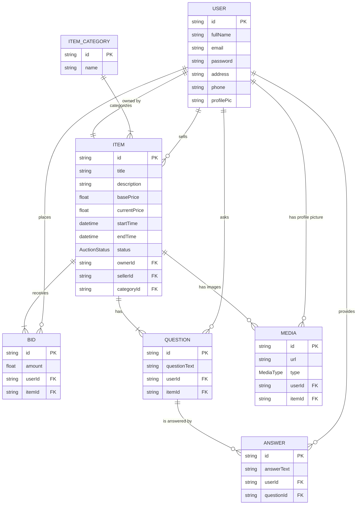

# NestJS Auction Platform

This is a backend application for a real-time auction platform built with NestJS, TypeORM, and PostgreSQL. It provides APIs for user management, creating and bidding on items, a question and answer system for items, and more.

## Features

- User Authentication (JWT)
- Item Management (Create, View, Update)
- Real-time Bidding
- Question & Answer System for Items
- Image Uploads for Items and User Profiles


### Prerequisites

- [Node.js](https://nodejs.org/)
- [npm](https://www.npmjs.com/)
- [PostgreSQL](https://www.postgresql.org/)

### Installation & Setup

1.  **Clone the repository:**
    ```bash
    git clone <https://github.com/rasel3780/Auction_Backend.git>
    cd auction
    ```

2.  **Install dependencies:**
    ```bash
    npm install
    ```

3.  **Setup Environment Variables:**
    Create a `.env` file in the root of the project and add the following variables.

    # Nodemailer (for sending emails)
    GMAIL_USER=your_email@gmail.com
    GMAIL_APP_PASS=your_gmail_app_password
    ```

4.  **Run the application:**
    ```bash
    # Start in development mode with auto-reloading
    npm run start:dev
    ```
    The application will be running on `http://localhost:3000`.


| Package                 | Purpose                                                                                                                                |
| ----------------------- | -------------------------------------------------------------------------------------------------------------------------------------- |
| `@nestjs/common`        | Core NestJS framework module, providing fundamental decorators and classes.                                                            |
| `@nestjs/core`          | Core functionality for creating and running a NestJS application.                                                                      |
| `@nestjs/platform-express` | Express.js adapter for NestJS, allowing it to run on top of the Express framework.                                                     |
| `@nestjs/typeorm`       | Integrates NestJS with TypeORM, a powerful Object-Relational Mapper (ORM) for TypeScript and JavaScript.                                 |
| `pg`                    | PostgreSQL client for Node.js. The driver used by TypeORM to connect to the database.                                                  |
| `@nestjs/jwt`           | Implements JSON Web Tokens (JWT) for authentication and authorization strategies.                                                      |
| `@nestjs/config`        | Provides a module for managing application configuration using `.env` files and environment variables.                                   |
| `@nestjs/schedule`      | A module for scheduling tasks and cron jobs, used here for managing auction statuses.                                                  |
| `@nestjs-modules/mailer`| A module for sending emails, used for notifications.                                                                                   |
| `class-validator`       | A decorator-based library for validating object properties, used extensively in DTOs.                                                  |
| `class-transformer`     | A library for transforming plain objects to class instances and vice-versa, used with `class-validator`.                               |
| `bcrypt`                | A library for hashing passwords to securely store them.                                                                                |
| `multer`                | Middleware for handling `multipart/form-data`, used for file uploads.                                                                  |
| `@nestjs/swagger`       | Generates OpenAPI (Swagger) documentation for your API, making it easy to visualize and interact with.                                   |


## Database Schema (ER Diagram)

The following diagram illustrates the relationships between the main entities in the database.

